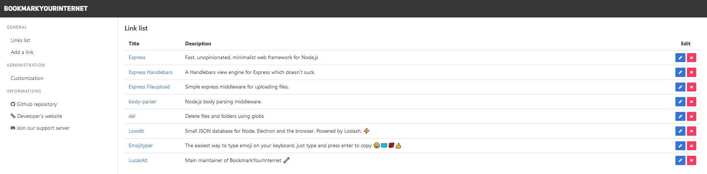

# BookmarkYourInternet
> A minimalist bookmarking service

[](https://discord.gg/nEDcagb)
[](https://github.com/LucasCtrl/bookmarkYourInternet/blob/master/LICENSE)

[](https://github.com/LucasCtrl/BookmarkYourInternet/release/latest/)



## Installation

```sh
npm install
# or
yarn install
```

## Usage example

Define your port inside `config.json`

```sh
npm start
# or
yarn start
```
Then, go to the following link: `localhost:PORT`

## Release History

* 0.2.0
    * Adding a system to add custom styles
    * Add favicon

* 0.1.0
    * Project start
    * Setting up a small database with lowbd
    * Front end installation with Bulma

## Meta

LucasAlt – [@LucasCtrlAlt](https://twitter.com/lucasctrlalt) – lucasalt@protonmail.com

Distributed under the GNU GNLv3.0 license. See `LICENSE` for more information.

## Contributing

1. Fork it (<https://github.com/LucasCtrl/bookmarkYourInternet/fork>)
2. Create your feature branch (`git checkout -b feature/fooBar`)
3. Commit your changes (`git commit -am 'Add some fooBar'`)
4. Push to the branch (`git push origin feature/fooBar`)
5. Create a new Pull Request